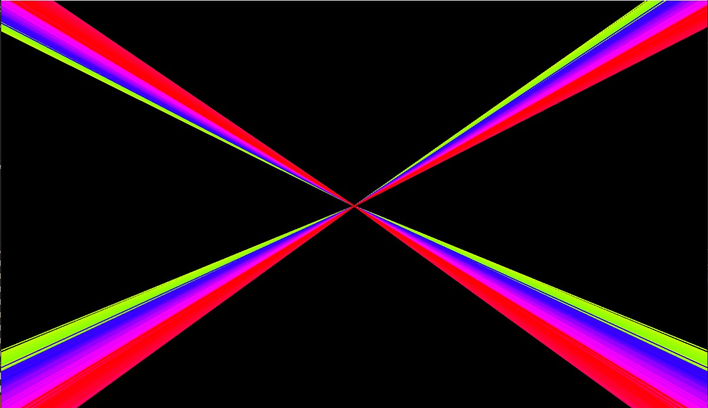
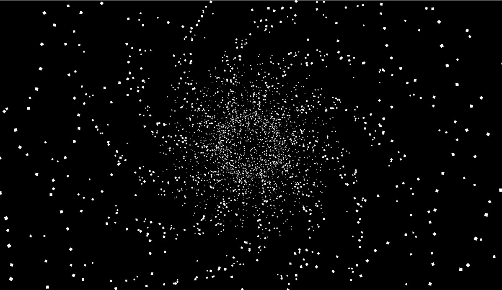
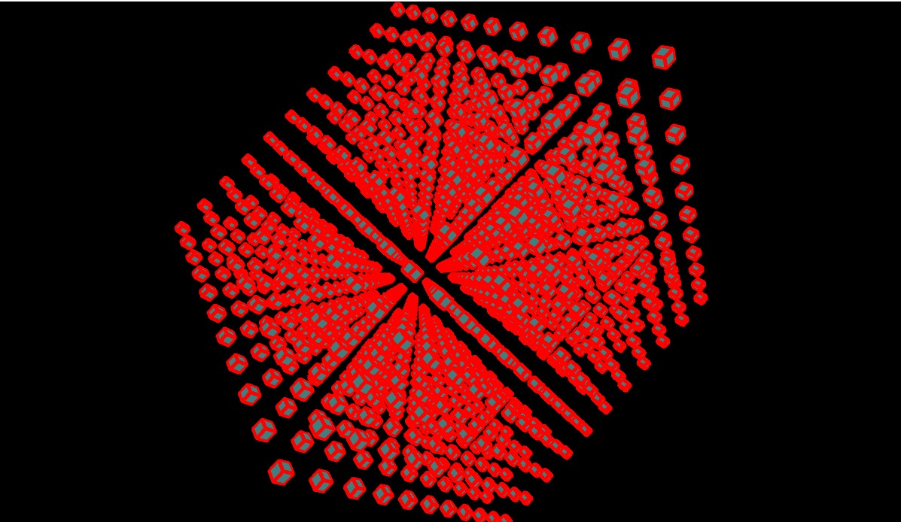
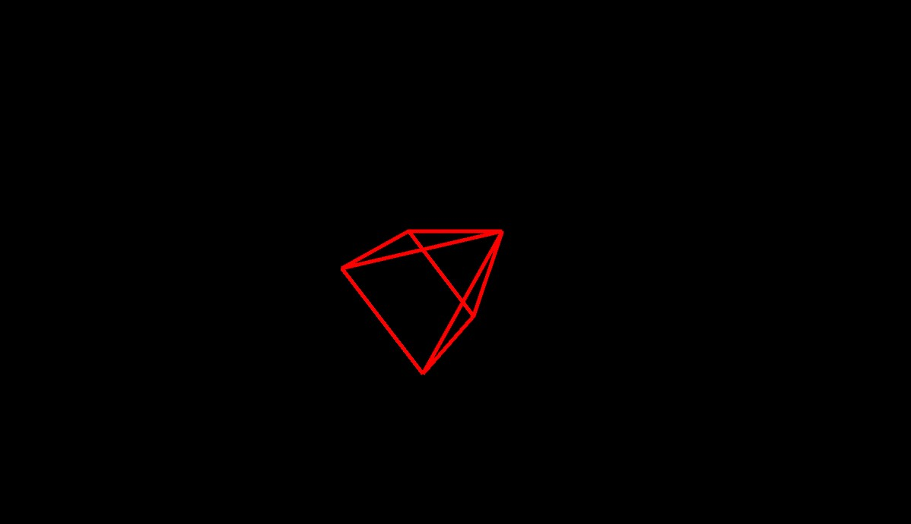
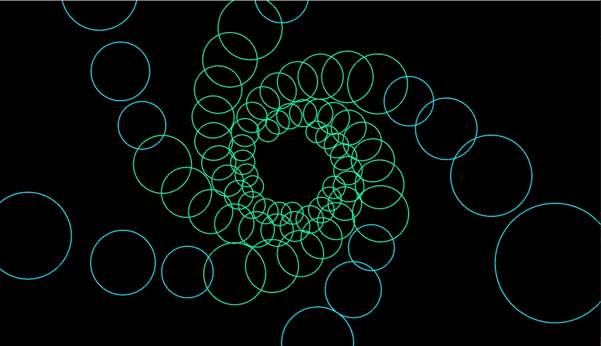
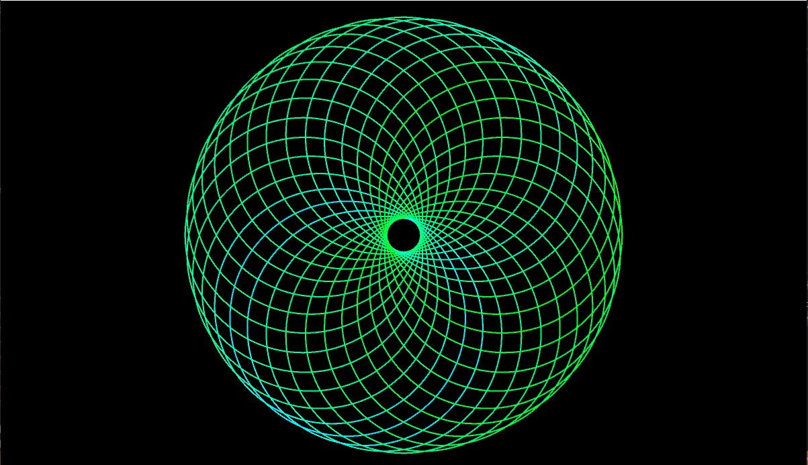
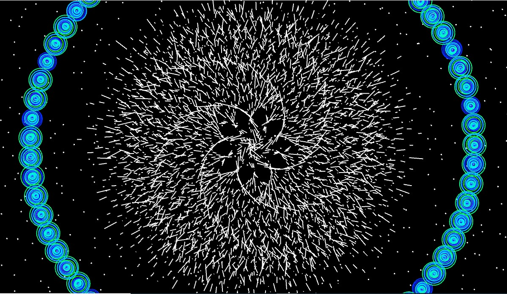

# OOP_assigment_bidibao
A repository for a group assignment: 
Shamsuddin Refaei C20308491,
Mervin Ilyaz C20371681, 
Dumitru Cojocari C20321911, 
Ivan Medved C20338661.

# Description of the assignment
For this assignment, we have created an audio visual experience using Java code. We have picked an audio piece and created visual effects that match it, creating a cool visual experience that users can watch.
The audio we have chosen is called
When the code is run, the music plays and a visual experience begins, taking the user on a journey where they see many different transitions, lights, colours and movement. Every sound and every beat is replicated with colour and movement which is satisfying and enjoyable to watch.

case 0:
For this case we used mapping function to draw 4 lines on the screen starting from the middle and that go in 4 corners of the screen and using the lepred buffer so that the behavior of the lines changes with the bit of the song.

case 1:

case 2:

case 3:

case 4:

case 5:

case 6:

# Instructions
To control the visual experience, users can press numbers on the keyboard from 0 to 6. There are multiple effects to choose from and each one has different shapes, sizes, colours and transitions. The audio is the same throughout the whole experience but every visual effect is different.

# How it works
To run the project, the Java folder must be loaded in Visual Studio Code and the Main class file must be run. Next, the user can cycle through different effects and transitions using numbers on the keyboard from 0 to 6.

# What I am most proud of in the assignment
One thing we are proud of in this project is the amount of effects we were able to create by using our own code which differs from any code in previous lectures. Using trial and error, we were able to figure out a way to make complex and impressive transitions, shapes and visuals to include in our project.
Another thing we are proud of is our ability to work as a team to make the best version of this project that we could. We spent hours coding together, fixing issues, solving problems and adding different pieces of code to the project in order to create the final version that we have now.

# Youtube Video

